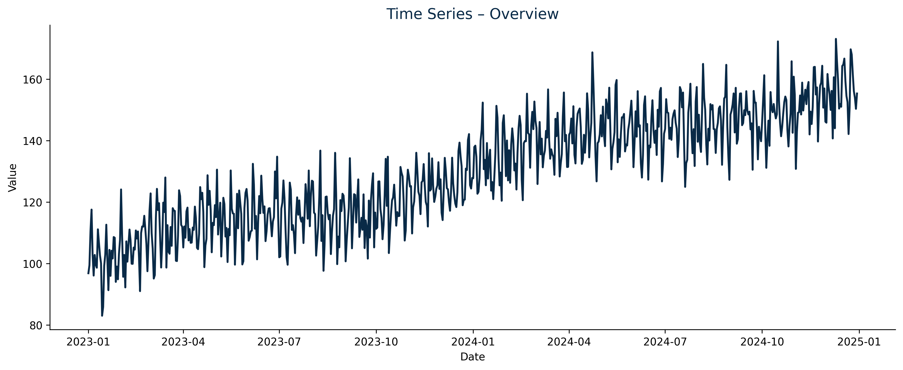
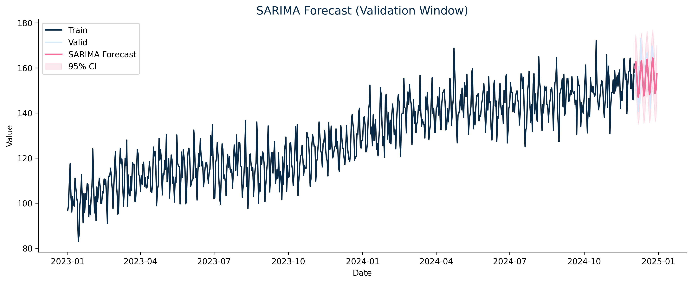
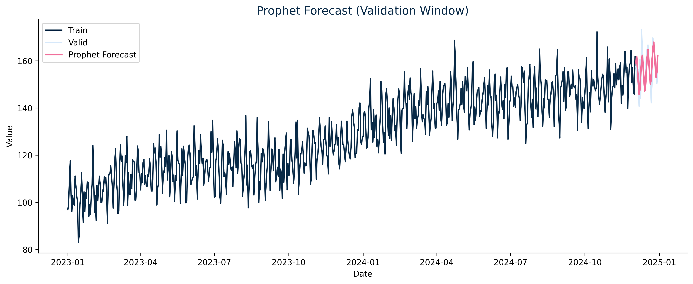

# Time Series Project – Forecasting with ARIMA & Prophet

This project demonstrates an **end-to-end time series forecasting workflow** using **SARIMA** and **Prophet** models.  
The goal is to explore temporal patterns (trend, seasonality, noise) and predict future values on a synthetic daily dataset.

---

## roject Overview
- **Goal:** Build, evaluate, and compare classical (SARIMA) and modern (Prophet) time series models.  
- **Techniques:**  
  - Time series decomposition (trend, seasonality, residuals)  
  - ADF stationarity test  
  - Baseline vs. model performance comparison  
  - Multi-step forecasting and visual validation  
- **Tools:** Python, Pandas, Statsmodels, Prophet, Matplotlib  

---

## Key Visualizations

| Visualization | Description |
|----------------|-------------|
| **Time Series Overview** | Raw daily signal with simulated trend and weekly seasonality |
| **Seasonal Decomposition** | Trend, seasonality, and residual breakdown |
| **ACF & PACF** | Autocorrelation structure for model order selection |
| **SARIMA Forecast** | 4-week forecast with confidence intervals |
| **Prophet Forecast** | Forecast capturing weekly and yearly patterns |

